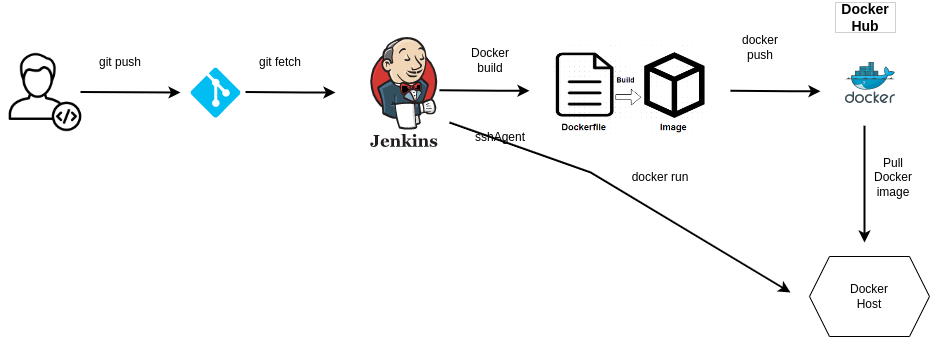

# Jenkins CI/CD Pipeline Project for Java Web Application

This project demonstrates how to use Jenkins to automate the build, containerization, and deployment of a Java web application. The project uses Git to pull the source code from a remote repository, Maven to build the application, Docker to containerize the application, and Docker Hub to push the container image. Finally, the container is deployed on a Docker host using SSH agent.

## Prerequisites

- Jenkins server
- Git installed on the Jenkins server
- Docker installed on the Jenkins server
- Docker Hub account
- Docker host with SSH access

## Pipeline Overview

The pipeline has the following stages:

1. **Pull source code from Git repository**: The pipeline starts by pulling the source code from the remote repository on GitHub.

2. **Maven build**: The pipeline uses Maven to build the Java web application.

3. **Containerization**: The pipeline creates a Docker container image for the application.

4. **Docker Hub push**: The pipeline pushes the container image to Docker Hub.

5. **Deploy to Docker host**: The pipeline deploys the container image to the Docker host using SSH agent.

## Pipeline Configuration

1. **Create a new Jenkins job**: From the Jenkins home page, select "New Item" and choose "Pipeline".

2. **Configure the pipeline script**: In the pipeline configuration page, select "Pipeline script from SCM" as the definition, and enter the URL for your Git repository.

3. **Configure SSH agent**: To deploy the container on the Docker host, you need to configure the SSH agent. In the pipeline script, add the following code to configure the SSH agent:

   ```
   stage('SSH Agent') {
       sshagent(['my-ssh-credentials']) {
           // add the code to deploy the container to the Docker host
       }
   }
   ```

   Replace `my-ssh-credentials` with the name of your SSH credentials in Jenkins.

4. **Configure Docker Hub credentials**: To push the container image to Docker Hub, you need to configure the Docker Hub credentials. In the pipeline script, add the following code to configure the Docker Hub credentials:

   ```
   stage('Docker Push'){
         withCredentials([string(credentialsId: 'dockerhubpwd', variable: 'dockerhubpwd')]) {
          sh "docker login -u 224574 -p ${dockerhubpwd}"
       }
       sh 'docker push 224574/my-app:1.0'
    }
   ```

   Replace `docker-hub-creds` with the name of your Docker Hub credentials in Jenkins.

## Pipeline Code

Here is the code for the Jenkins pipeline:

```
node{
    stage('SCM checkout'){
        git branch: 'main', credentialsId: '3556331b-958c-41cd-b636-918833670bc2', url: 'https://github.com/abhilashkb/Jenkins-ci-cd-pipeline'
    }
    stage('Maven Package'){
        mvnHome = tool name: 'maven-3.8.7', type: 'maven'
        sh "${mvnHome}/bin/mvn clean package"
    }
    stage('Docker build'){
        sh 'docker build -t 224574/my-app:1.0 .'
    }
    stage('Docker Push'){
         withCredentials([string(credentialsId: 'dockerhubpwd', variable: 'dockerhubpwd')]) {
          sh "docker login -u 224574 -p ${dockerhubpwd}"
       }
       sh 'docker push 224574/my-app:1.0'
    }
    stage('Run container on Dev Server'){
        def dockerrun = 'docker container run -d --name myapp -p 8080:8080 224574/my-app:1.0'
        sshagent (['dockerhost1']) {
    sh "ssh -o StrictHostKeyChecking=no -l ansadmin ${ip} -p1080 ${dockerrun}"
  }
    }
    
}
